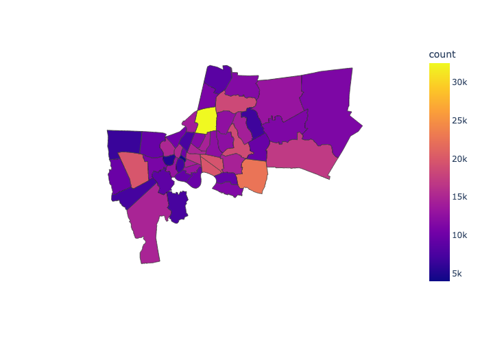
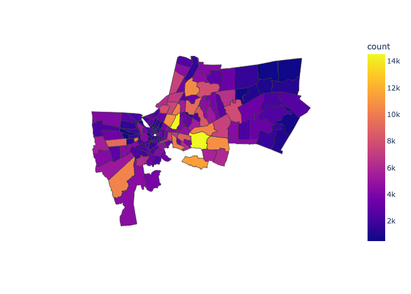
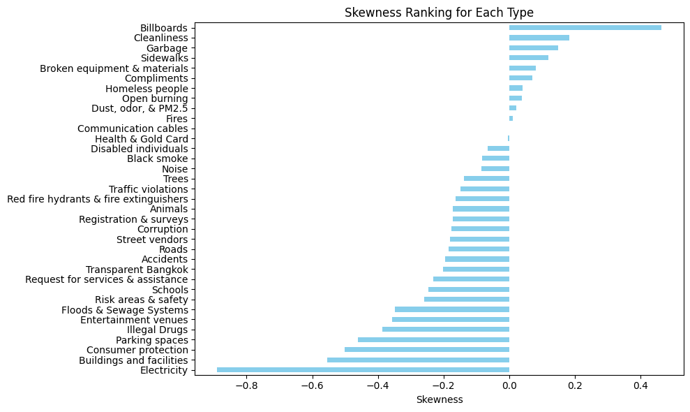

# 🕒 ChAMP Engineering Data Track: Case Duration Outlier Detection & Correlation Analysis (Traffy Fondou)

This **Data Science & Analysis** project is part of the **ChAMP Engineering Data Track**, utilizing real-world data from **Bangkok Metropolitan Administration (กทม)** to identify insights, diagnose potential inefficiencies, and propose actionable solutions regarding case resolution times.

---

## 🚀 Project Overview

This project aims to improve the efficiency of **case resolution processes in Bangkok** by analyzing case duration data, detecting anomalies, uncovering patterns, and identifying cases that should have been resolved quickly. The analysis is divided into three main parts:

### **Part 1: Data Cleaning & Preparation**
1. **Combining Datasets:** Merging the case dataset with the logging time dataset, which includes timestamps for when cases were reported and resolved.
2. **Data Cleaning:** Removing inconsistencies and handling missing values for proper analysis.
3. **Filtering Bangkok Cases:** Ensuring that only cases from Bangkok are included in the analysis, excluding cases from other districts.

### **Part 2: Case Distribution Analysis**
1. **District & Subdistrict Analysis:** Identifying which districts and subdistricts in Bangkok have the highest number of reported cases.
2. **Geospatial Trends:** Examining the spatial distribution of case reports to highlight high-density problem areas.

### **Part 3: Outlier Detection & Correlation Analysis**
1. **Outlier Detection:** Identifying cases that take significantly longer than usual to resolve using **statistical methods (IQR, percentile thresholds)** and **machine learning (Isolation Forest)**.
2. **Correlation Analysis:** Exploring relationships between case duration and key factors such as **reopens, view counts, and organizational actions** to determine possible causes of delays.
3. **Filtering & Comparative Analysis:** Investigating specific case types (e.g., **Billboards, Electricity, Road and Sidewalk**) and filtering data by percentile-based thresholds (e.g., **inpexcting upper 5% cases**).
4. **Data-Driven Recommendations:** Providing insights into why some cases take longer to resolve and **suggesting potential solutions** for efficiency improvement.

---

## 🎯 Key Findings & Insights

### 🏙️ Top 5 Districts with the Most Cases
1. **จตุจักร** 
2. **ประเวศ**
3. **บางแค** 
4. **คลองเตย** 
5. **วัฒนา**

(A Capture of plotly express interactive choropleth map)

### 🏘️ Top 5 Subdistricts with the Most Cases
1. **สวนหลวง** 
2. **ดินแดง** 
3. **สามเสนใน** 
4. **ประเวศ** 
5. **อนุสาวรีย์**

(A Capture of plotly express interactive choropleth map)

### 🌆 Case Types Skewness and Outliers
Certain case types exhibit **skewed resolution times**, leading to **delays** in their resolution.

### 📊 Factors Affecting Case Duration
From correlation analysis, the following variables show a **positive relationship** with longer case durations:
- **Number of Reopens (`count_reopen`)** → Cases that are repeatedly reopened take significantly longer to resolve.
- **View Count (`view_count`)** → High public engagement might indicate complex cases requiring more time.
- **Organization Action Length (`organization_action_len`)** → More organization being involved may correlate with inefficiencies in processing.

### 💡 Suggested Solutions
- **Process Streamlining:** Identify types of **organizational actions** that contribute to longer delays and optimize workflows.
- **Prioritization Strategy:** Focus on **frequently reopened cases** and introduce measures to resolve them effectively.
- **Public Engagement Analysis:** Evaluate whether high **view counts** correlate with complex cases and allocate resources accordingly.

---

## 🤖 Machine Learning Model

The project incorporates **Isolation Forest**, an unsupervised anomaly detection model from **Scikit-Learn**, to detect cases with unusually long or short resolution times.

- **Why Isolation Forest?**
  - Works well with **log-transformed duration data**.
  - Detects anomalies **without requiring predefined thresholds**.
  - Identifies both **upper and lower outliers**, making it ideal for this analysis.

---

## 🛠️ Technologies Used
- **Data Handling:** Pandas
- **Visualization:** Matplotlib, Seaborn, Plotly
- **Machine Learning:** Scikit-Learn (Isolation Forest)
- **Statistical Analysis:** NumPy, SciPy

---

## 🌟 Acknowledgements

This project is part of the **ChAMP Engineering Data Track**, using real-world data from **Bangkok Metropolitan Administration (กทม)**.
Special thanks to **ChAMP Engineering Data Track mentors, fellow mentees, and the กทม team** for their support and contributions!

