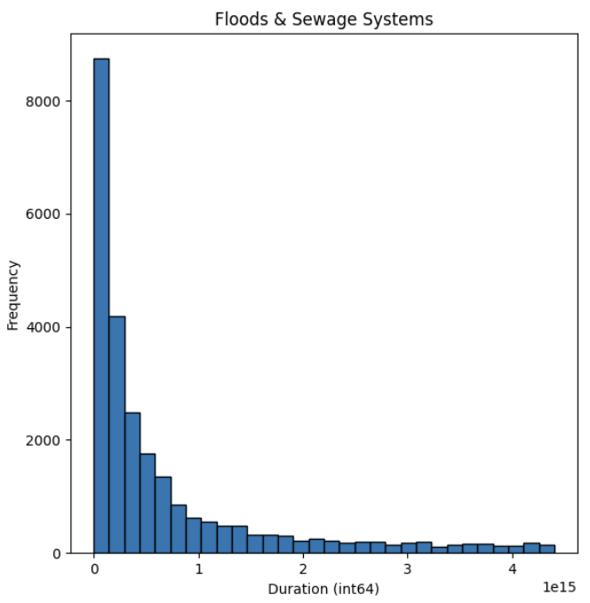
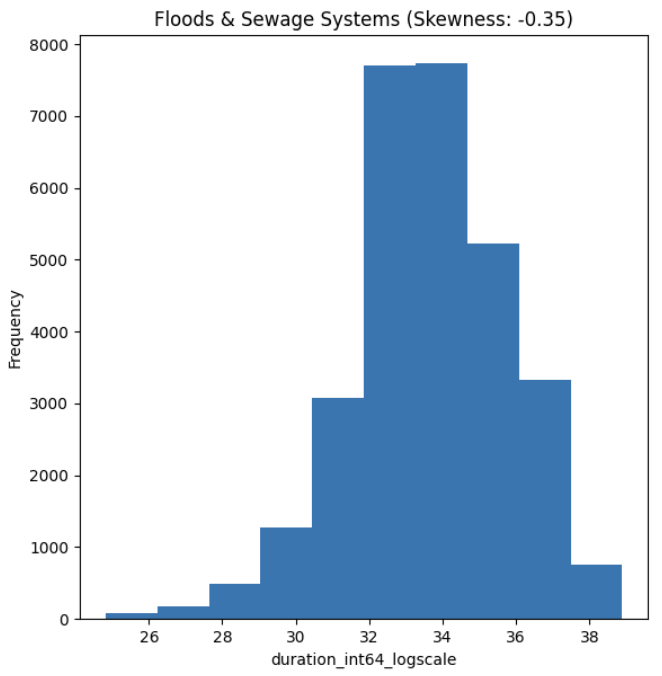
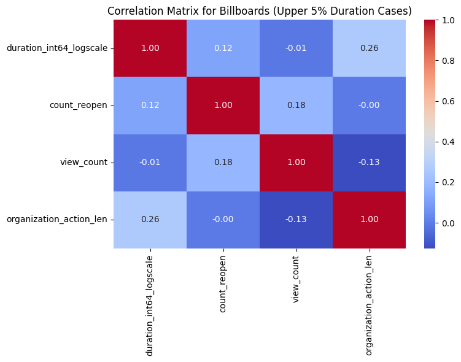
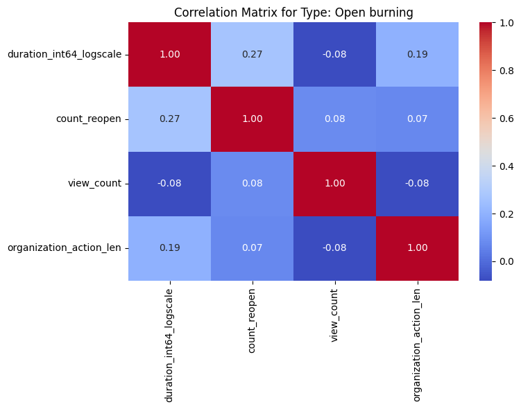
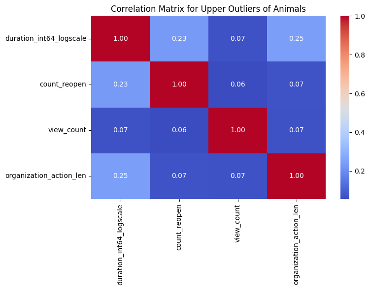

# 🕒 ChAMP Engineering Data Track: Case Duration Outlier Detection & Correlation Analysis (Traffy Fondou)

This **Data Science & Data Analysis** project is part of the **ChAMP Engineering Data Track**, utilizing real-world data from **Bangkok Metropolitan Administration (กทม)** to identify insights, diagnose potential inefficiencies, and propose actionable solutions regarding case resolution times.

**Dataset Period:** May 2022 - December 2024

---

## 🚀 Project Overview

**Problem:**
* Which problems can be solved quickly but takes a long time to be resolved? Pinpoint the reason why.
* Note: Only for Bangkok

This project aims to improve the efficiency of **case resolution processes in Bangkok** by analyzing case duration data, detecting anomalies, uncovering patterns, and identifying cases that should have been resolved quickly. The analysis is divided into three main parts:

### **Part 1: Data Cleaning & Preparation**
1. **Combining Datasets:** Merging the case dataset with the logging time dataset, which includes timestamps for when cases were reported and resolved.
2. **Data Cleaning:** Removing inconsistencies and handling missing values for proper analysis.
3. **Filtering Bangkok Cases:** Ensuring that only cases from Bangkok are included in the analysis, excluding cases from other districts.

### **Part 2: Case Distribution Analysis**
1. **District & Subdistrict Analysis:** Identifying which districts and subdistricts in Bangkok have the highest number of reported cases.
2. **Geospatial Trends:** Examining the spatial distribution of case reports to highlight high-density problem areas.

### **Part 3: Outlier Detection & Correlation Analysis**
1. **Outlier Detection:** Identifying cases that take significantly longer than usual to resolve using **statistical methods (IQR, percentile thresholds)** and **machine learning (Isolation Forest)**.
2. **Correlation Analysis:** Exploring relationships between case duration and key factors such as **reopens, view counts, and organizational actions** to determine possible causes of delays.
3. **Filtering & Comparative Analysis:** Investigating specific case types (e.g., **Billboards and Electricity as they are some of the most skewed**) and filtering data by percentile-based thresholds (e.g., **inpexcting upper 5% cases**).
4. **Data-Driven Recommendations:** Providing insights into why some cases take longer to resolve and **suggesting potential solutions** for efficiency improvement.

---

## 🎯 Key Findings & Insights

### 🏙️ Top 5 Districts with the Most Cases
1. **Chatuchak (จตุจักร)** - 32,457 cases
2. **Prawet (ประเวศ)** - 22,490 cases
3. **Bang Khae (บางแค)** - 19,724 cases
4. **Khlong Toei (คลองเตย)** - 19,668 cases
5. **Watthana (วัฒนา)** - 19,508 cases

(A Capture of plotly express interactive choropleth map)

### 🏘️ Top 5 Subdistricts with the Most Cases
1. **Suan Luang (สวนหลวง)** - 14,539 cases
2. **Din Daeng (ดินแดง)** - 14,538 cases
3. **Sam Sen Nai (สามเสนใน)** - 10,938 cases
4. **Prawet (ประเวศ)** - 10,748 cases
5. **Anusawari (อนุสาวรีย์)** - 10,583 cases

(A Capture of plotly express interactive choropleth map)

### 🌆 Cases with Extended Resolution Periods

Considerations regarding cases that take too long to resolve can be separated into 3 ways:

#### **1) Skewness of the distribution**

After plotting bar charts, it is evident that the duration for each case type is extremely skewed.

(An example of a bar chart of a case type before taking Log)

Hence, the duration must be normalized by taking Log.

(An example of a bar chart of a case type after taking Log)

The bar chart illustrates the skewness for each case type after nomalizing the resolution duration.

- A **Positive skew** means that most cases in this category are resolved **quickly**, but a **few take significantly longer**, creating a long right tail in the distribution.
- A **Negative skew** indicates that most cases have a **longer resolution time**, with **only a few cases being resolved quickly**.

(An example of correlation heatmap considering positively skewed distribution)

#### **2) Outlier detection (For outliers of every type)**

- If any outliers were to exist, even after normalizing the distribution, they would be considered as taking too long to resolved.

(An example of correlation heatmap considering upper outliers)

#### **3) Unsupervised Machine Learning**

The project also incorporates **Isolation Forest**, an unsupervised anomaly detection model from **Scikit-Learn**, to detect cases with unusually long or short resolution times.

- **Why Isolation Forest?**
  - Works well with **log-transformed duration data**.
  - Detects anomalies **without requiring predefined thresholds**.
  - Identifies both **upper and lower outliers**, making it ideal for this analysis.
 
(An example of correlation heatmap for anamolies in a type)

### 📊 Factors Affecting Case Duration
From correlation analysis, the following variables show a **positive relationship** with longer case durations:
- **Organizations Involved (`organization_action_len`)** → More organization being involved may correlate with inefficiencies in processing.
- **Number of Reopens (`count_reopen`)** → Cases that are repeatedly reopened take significantly longer to resolve.
- **View Count (`view_count`)** → High public engagement might indicate complex cases requiring more time (only for some type).

### 💡 Suggested Solutions

- **Process Streamlining:** Identify types of **organizational actions** that contribute to longer delays and optimize workflows. Possible solutions for this include clearly defining the area of responsibilities for each organization so that users would know to whom the cases should be reported, while the organizations know which cases they are responsible for.
- **Prioritization Strategy:** Focus on **frequently reopened cases** and introduce measures to resolve them effectively. This can help prevent similar cases being repeatedly reopened as well.
- **Public Engagement Analysis:** Evaluate whether high **view counts** correlate with complex cases and allocate resources accordingly. This shows that people are interested to know whether the particular cases are resolved or not.

---

## 🔍 Further Considerations
While the current analysis focuses on **outlier detection and correlations**, additional factors could improve our insights:

- **Geospatial Correlations:** Analyzing case duration in relation to **district and subdistrict** could help determine if certain locations experience systemic delays.
- **Organizational Proximity Analysis:** Incorporating the **physical location of responsible organizations** could help assess whether **proximity affects response times**.
- **Time-Based Trends:** Examining whether **certain times of the year or specific days of the week** impact response efficiency.

Incorporating these additional analyses could further refine our understanding of case resolution inefficiencies and guide more effective solutions.

---

## 🛠️ Technologies Used
- **Data Handling:** Pandas
- **Visualization:** Matplotlib, Seaborn, Plotly
- **Machine Learning:** Scikit-Learn (Isolation Forest)
- **Statistical Analysis:** NumPy, SciPy

---

## 🌟 Acknowledgements

This project is part of the **ChAMP Engineering Data Track**, using real-world data from **Bangkok Metropolitan Administration (กทม)**.
Special thanks to **ChAMP Engineering Data Track mentors, fellow mentees, and the กทม team** for their support and contributions!

